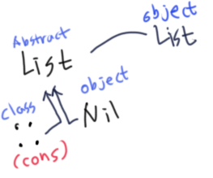

# List in functional programming

## List를 이루는 두 가지, Nil과 ::(Cons)


Scala에서 List의 정의는 `scala.package.collection.immutable`에 `abstract class`로 다음과 같이 정의 되어 있다.
```scala
sealed abstract class List[+A] extends ...
  def isEmpty: Boolean
  def head: A
  def tail: List[A]
```

`scala.package.collection.immutable.List`는 추상클래스이지만, 같은 파일 내에 `companion object`로 List가 정의되어 있다.


그러나 실제 List의 메소드들은 전부 추상 클래스 List에 정의되어 있으며, object List는 List 생성을 위한 factory로서 기능을 한다.


List는 `::`와 `Nil` 두 가지 구현체가 존재하는데, Scala는 기호도 이름이 될 수 있기때문에, `Non-empty List`, 흔히 `LinkedList`를 구현할 때 `Node`에 해당하는 클래스를 `::`라고 하며 `cons`라고 부른다.

`::`(`Cons`)의 구현은 다음과 같다
```scala
final case class ::[B](override val head: B, private[scala] var tl: List[B]) extends List[B] {
  override def tail : List[B] = tl
  override def isEmpty: Boolean = false
}
```

반대로 `Empty List`를 표현하는 Nil은 다음과 같다.
```scala
case object Nil extends List[Nothing] {
  override def isEmpty = true
  override def head: Nothing =
    throw new NoSuchElementException("head of empty list")
  override def tail: List[Nothing] =
    throw new UnsupportedOperationException("tail of empty list")
  ...
}
```

## 왜 Nil이 필요할까?
Immutable `List`의 spec은 element인 `head`와 나머지 `List`를 가리키는 `tail`로 구성이 되어 있다. 
먼저 scala에 정의된 `List`를 구경해보자. 상속받은 클래스가 많아 이는 생략했다.
```scala
sealed abstract class List[+A] extends ... {

  def isEmpty: Boolean
  def head: A
  def tail: List[A]
  ...
}
```
보는 바와 같이 `head`는 한 요소, `tail`은 다음 `List`를 가리킨다.

`Nil`은 `List`를 상속받은 `List`이다. 데이터가 없기때문에 element라고 착각하기 쉽지만 size가 0인 `List`이기때문에 모든 `List`의 마지막 element를 의미한다. scala에서 `Nil`의 구현은 다음과 같다.
```scala
case object Nil extends List[Nothing] {
  override def isEmpty = true
  override def head: Nothing =
    throw new NoSuchElementException("head of empty list")
  override def tail: List[Nothing] =
    throw new UnsupportedOperationException("tail of empty list")
  ...
}
```
늘 비어 있고, `head`와 `tail` 역시 `Nothing`인 싱글턴 객체이다.

이해를 확실히 했다면 추가적으로 `::`(Cons) 메소드 마지막을 항상 Nil 또는 List로 장식해야하는지 이해할 수 있다.
```scala
    1 :: 2 :: 3 //error! 3은 List가 아니다
    1 :: 2 :: 3 :: Nil //OK
    1 :: 2 :: 3 :: List(2, 7, 3) //OK
```

`::`는 List의 메소드이지, Int의 메소드가 아니다. 위 코드는 아래와 똑같다.
```scala
    3.::(2).::1 //Error, 3, 즉 Int에는 :: method가 없다.
    Nil.::(3).::(2).::1 //OK, Nil은 List이기때문에 :: 메소드가 존재한다
    List(2, 7, 3).::(3).::(2).::(1)
```

그럼 주요 List의 method들의 기능을 살펴보자

## List의 주요 method
1. `apply`  
   Java에서 List의 n번째 요소에 접근할 때는 대괄호를 사용하지만, scala에서는 그냥 일반 소괄호를 사용한다. 
   ```scala
   myList(3) //equal to myList.apply(3)
   ```
   이 경우는 3번째 인덱스의 값을 가져오는 list메소드로    실제로는 apply method와 똑같다.

2. `::` (prepend)  
   어! 이거 아까는 클래스라며? 근데 method도 있다ㅎ.. method로서의 `::`가 위에서 열심히 언급한 prepend 기능이다.
   ```scala
       1 :: 2 :: Nil // equal to List(1, 2)
   ```
   위 코드는 Nil이 앞에 2를 붙이고, 그 결과에 1을 붙인다. 순서가 오른쪽에서 왼쪽으로 붙이는데, 왼쪽 객체의 tail(다음 노드)로 오른쪽 객체를 붙인다.

3. `:::` (Concatenates list)  
   두 List를 하나로 합친 결과를 리턴한다.
   ```scala
       (1 :: 2 :: Nil) ::: (3 :: 4 :: Nil) // List(1, 2, 3, 4)
   ```

4. `reverse_:::`
   앞에 있는 List를 뒤집어서 앞에 붙인다.
   ```scala
       (1 :: 2 :: Nil) reverse_::: (3 :: 4 :: Nil) // List(2, 1, 3, 4)
   ```

5. `drop`
   인자로 주어진 갯수만큼만 앞에서부터 버린다.
   ```scala
   //첫 두개를 제외한 나머지로 구성된 새 List가 반환된다.
   List(1, 2, 3, 4).drop(2) //List(3, 4)
   ```

6. `dropRight`
인자로 주어진 갯수만큼만 뒤에서부터 버린다.
   ```scala
   List(1, 2, 3, 4).dropRight(1) //List(1, 2, 3)
   ```

7. `exist`
   List안에 주어진 조건이 참이 되는 값이 있는지 확인한다.
   ```scala
   List(1, 2, 3).exists(s => s > 2) // true
   List(1, 2, 3).exists(s => s > 10) // false
   ```

8. `filter`
   참이 되는 값만으로 구성된 새로운 List를 반환한다.
   ```scala
   List(1, 2, 3).filter(x => x <= 2) //List(1, 2)
   ```

9. `forall`
   List내의 모든 element들이 주어진 조건을 만족하는지 확인한다.
   ```scala
   List(1, 2, 3).forall(x => x < 4) //true
   List(1, 2, 3).forall(x => x > 2) //false
   ```

10. `foreach`
   List내 모든 element들을 순회한다.
   ```scala
   List('a', 'b', 'c').foreach(c => print(c + "!")) //a!b!c!
   ```

11. `head`
   `List`의 첫 번째 element를 리턴한다. 주의할 것이 `head`는 method이다.

12. `init`

13. `isEmpty`

14. `last`

15. `length`

16. `map`

17. `mkString`

18. `remove`

19. `reverse`

20. `sort`

21. `tail`