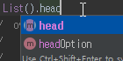

# 헷갈리는 Scala의 값 선언 방식  

List를 공부하다가 List의 주요 메소드 중 head와 tail의 선언을 보게 되었다.  
```scala
sealed abstract class List[+A] extends ... {
  def isEmpty: Boolean
  def head: A
  def tail: List[A]
```
Scala에 익숙치 않았기에 나는 `isEmpty`, `head`, `tail` 모두 메소드가 아닌 value라고 생각했다.

그러나 IntelliJ는 다음과 같이 메소드임을 알려주었다.


여기서 scala의 값과 메소드 선언 방식을 다시 공부할 필요를 느꼈다.
내가 아는 값 선언 방식은 아래처럼 `val` 혹은 `def`와 변수명, 타입과 할당 표현식이고
```scala
val num:Int = 35 //val num = 35 라고 해도 문제 없음
```
메소드 선언 방식은 `def`와 함수명, 파라미터 타입, 리턴타입, 함수 본체로 이루어지는 것이다.
```scala
class Some {
    def myMethod(v: Int): String = ...
    ...
}
```