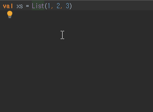
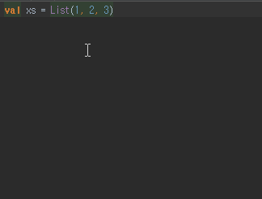
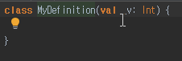
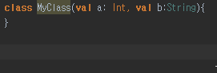
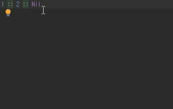
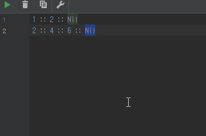
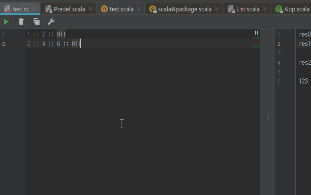
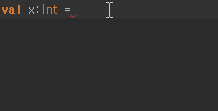
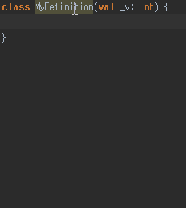
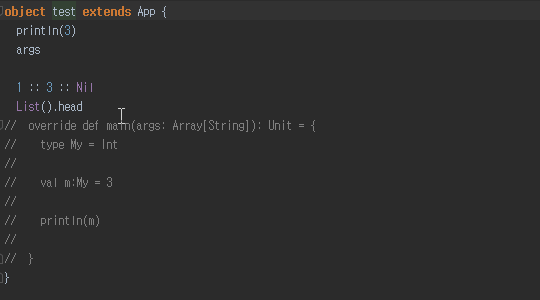

# 유용한 단축키

현재 커서가 놓인 구문의 선언문으로 이동 : `Ctrl` + `B` or `Ctrl` + `Alt` + `B`  

현재 커서가 놓인 타입의 구현 코드로 이동 : `Ctrl` + `Shift` + `B`

현재 커서가 놓인 구문부터 선택/해지(드래그 한 것처럼) : `Ctrl` + `W` / `Ctrl` + `Shift` + `W`  

Parameter정보 힌트 : `Ctrl` + `P`  

Document 보기 : `Ctrl` + `Q`  

현재 파일에서 Replace : `Ctrl` + `R`

전체 path에서 Find/Replace : `Ctrl` + `Shift` + `F/R`

Quick fix : `Alt` + `Enter`  

메소드, 클래스 등 코드 자동 작성 : `Alt` + `Insert`

최근 파일 리스트 보기 : `Ctrl` + `E`  

Rename : `Shift` + `F6`  

