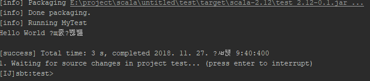
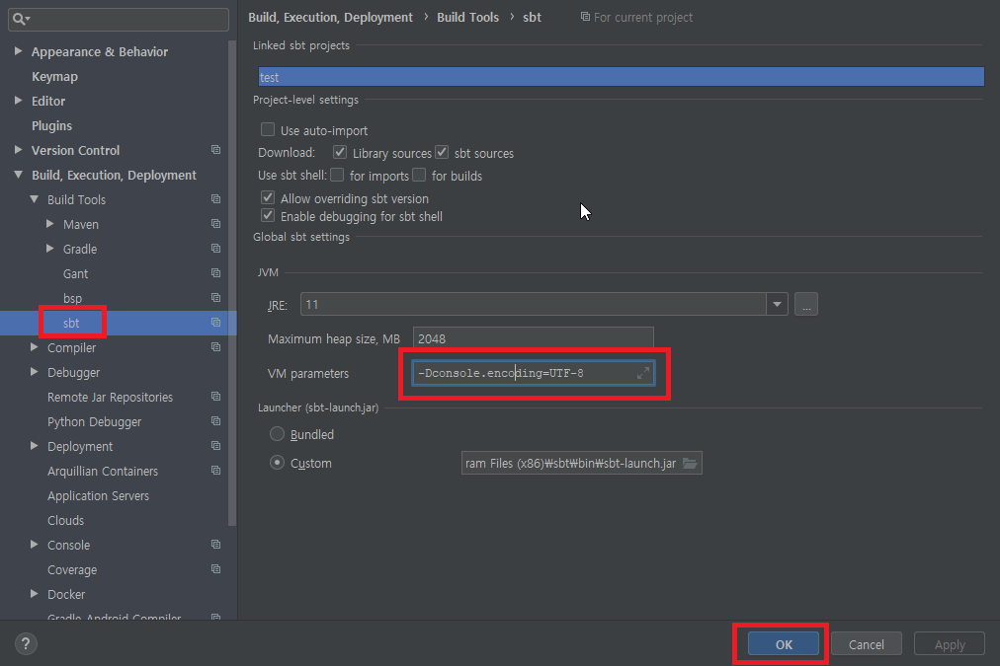
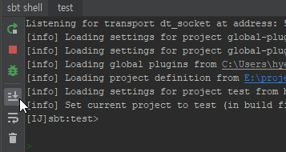

# IntelliJ의 console 한글 깨짐과의 전투

한글은 훌륭하지만, 대한민국의 개발자로서 가장 빡치는 일이라면 바로 한글깨짐 이슈처리를 꼽을 수 있다.
기본적으로 IntelliJ한글 설정을 하더라도 SBT를 IntelliJ 내장 SBT console에서 빌드하면 한글이 아래와 같이 깨지는 것을 볼 수 있다.  

sbt shell의 커맨드창 스크롤을 올려보면 -Dfile.encoding=UTF-8로 설정되어 있는데, console은 이와는 별도의 encoding을 가져다가 쓰는 것으로 보인다.

구글링해보니 IntelliJ 사이트에서 출력창 encoding 설정에 관련된 [내용](https://www.jetbrains.com/help/idea/configuring-output-encoding.html)이 있는데, 정확히 어디다가 하라고 하는지 안써놔서 시밤시밤거리면서 한참 헤맸다... 물론 제대로 동작하지 않아 IntelliJ 커뮤니티에 [질문글](https://intellij-support.jetbrains.com/hc/en-us/community/posts/360001788119-IntelliJ-sbt-shell-UTF-8-not-work)을 올렸다. 그리고 Youtrack에 [bug](https://youtrack.jetbrains.com/issue/SCL-14639)로 보고되었다  

****************해결되면 처리해야함  

---------------------------------
결론은 Setting에서(`Ctrl+Alt+S`) sbt 실행시 VM Argument에 `-Dconsole.encoding=UTF-8`을 추가해주어야 한다.

그리고 sbt를 다시 실행한다.(sbt shell의 빨간 정사각형을 누르고 초록색 버튼을 눌러 재기동한다)

`Shift + F10`을 눌러 결과를 확인해보자
