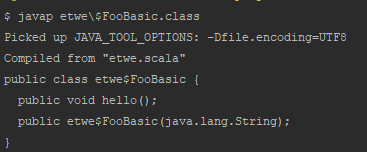
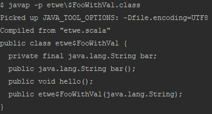
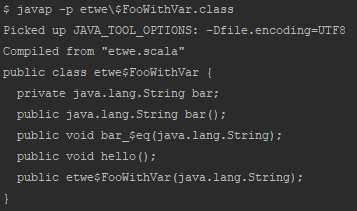
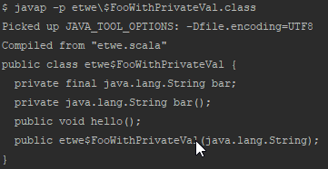
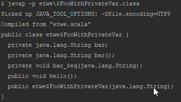
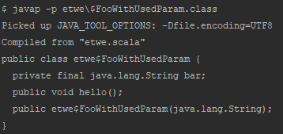
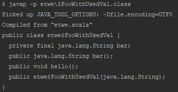
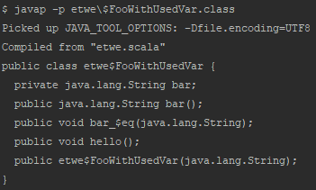
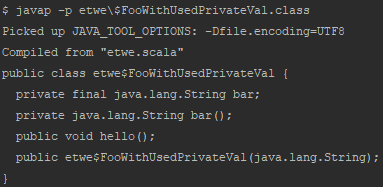
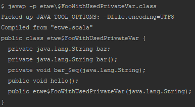

# 생성자 파라미터와 필드(Internal state)
`class`를 작성할 때 생성자 파라미터는 선언에 따라 필드와 Getter 자동 생성 여부가 달라진다. 아래의 예시의 java code로 변환 결과를 통해 이해하자

## 1. 생성자 Parameter가 생성자 이외에 쓰이지 않는 경우
```scala
class FooBasic(bar: String) {
    println(s"bar is $bar")

    def hello() = print("Hello")
}
```
먼저 위의 경우 결과는 아래와 같다(`javap -p etwe\$FooBasic`으로 했어야 했지만 결과가 똑같으니 바꾸지 않음)
  
메소드에서 사용하지 않는 parameter는 그냥 버려진다는 것을 알 수 있다.

## 2. 생성자 Parameter가 val로 선언되었지만 쓰이지 않는 경우
```scala
class FooWithVal(val bar: String) {
    println(s"bar is $bar")

    def hello() = print("Hello")
}
```
이번엔 명시적으로 val로 선언하였다. `val`로 bar라는 이름의 필드를 선언한 것과 다르지 않다.  
  
`private` 으로 필드가 선언되고 같은 이름의 Getter가 생겼다. Scala에서는 다음과 같이 필드이름으로 접근하지만 실제로는 Getter로 호출하는 것이다.
```scala
new FooWithVal().bar //bar라는 getter method를 호출한다
```

## 3. 생성자 Parameter가 var로 선언되었지만 쓰이지 않는 경우
```scala
class FooWithVar(var bar: String) {
    println(s"bar is $bar")

    def hello() = print("Hello")
}
```
이번엔 mutable한 var로 선언하였다.
  
var로 선언했기때문에 setter가 생겼는데, `bar_$eq`이 setter이다.
Scala에서는 아래와 같이 bar의 값을 바꿀 수 있다.
```scala
```
## 4. 생성자 Parameter가 private val로 선언되었지만 쓰이지 않는 경우
```scala
class FooWithPrivateVal(private val bar: String) {
    println(s"bar is $bar")

    def hello() = print(s"Hello")
}
```
다음은 명시적으로 `private`으로 선언한 경우다.
  
`private`을 붙이지 않았을 경우와 똑같이 필드와 Getter가 생성되었지만, Getter의 scope가 `private`이라는 점을 기억해야한다.

## 5. 생성자 Parameter가 private var로 선언되었지만 쓰이지 않는 경우
```scala
class FooWithPrivateVar(private var bar: String) {
    println(s"bar is $bar")

    def hello() = print(s"Hello")
}
```
  
`private`을 명시하지 않았을 때와 똑같이 필드, Getter, Setter가 생성되었지만, scope가 `private`으로 바뀌었다는 점이 차이점이다.

## 6. 생성자 Parameter가 메소드에서 사용되는 경우
```scala
class FooWithUsedParam(bar: String) {
    println(s"bar is $bar")

    def hello() = print(s"$bar")
}
```
  
메소드에서 사용되기때문에 필드로 저장해 둔다. 

## 7. val로 선언된 생성자 Parameter가 메소드에서 사용되는 경우
```scala
class FooWithUsedVal(val bar: String) {
    println(s"bar is $bar")

    def hello() = print(s"$bar")
}
```
  
필드와 getter 모두 생성된다.

## 8. var로 선언된 생성자의 Parameter가 메소드에서 사용되는 경우
```scala
class FooWithUsedVar(var bar: String) {
    println(s"bar is $bar")

    def hello() = print(s"$bar")
}
```
  
필드, getter, setter 모두 생성된다.

## 9. private val로 선언된 생성자의 Parameter가 메소드에서 사용되는 경우
```scala
class FooWithUsedPrivateVal(private val bar: String) {
    println(s"bar is $bar")

    def hello() = print(s"$bar")
}
```
  
7과 같은 결과다. 다만 scope가 private이다

## 10. private var로 선언된 생성자의 Parameter가 메소드에서 사용되는 경우
```scala
class FooWithUsedPrivateVar(private var bar: String) {
    println(s"bar is $bar")

    def hello() = print(s"$bar")
}
```
  
8과 같은 결과다. 다만 scope가 private이다.

# Index
## [Previous](./2018-11-28-constructor.md) | [Next](./2018-11-29-method.md)