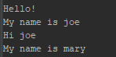

# Method
## Method 정의하기
객체 간의 의사소통 행위를 담당하는 Method를 Scala에서는 어떻게 정의하는지 알아보자. 먼저 특정 길이 이상의 텍스트에는 말줄임표(...)를 붙이는 `TextHelper` class를 개발하는 요구사항이 있다고 해보자.
```scala
class TextHelper {
    val suffix = "..."
}
```
여기에 실제 말줄임을 담당하는 `ellipse` 메소드를 정의해본다.
```scala
def ellipse(original: String, maxLength: Int): String = {
    return "Not implemented yet";
}
```
아래와 같이 선언한다.
`def` 메소드명(parameter1이름: 타입, parameter2이름: 타입 ...): 리턴타입 = {...}

사실 `=`을 생략하고 Java style로 하는 방법도 있고, Parameter가 없을 경우 `()`를 생략하는 등 여러가지가 있지만 위가 가장 표준적인 생김새이다.

Scala compiler는 타입 추론이 가능하기때문에 return 타입이 없으면 로직에서 추론한다. 위의 경우는 명백히 `return` `String`이므로 아래와 같이 생략이 가능하다.
```scala
def ellipse(original: String, maxLength: Int) = {
    return "Not implemented yet";
}
```
이제 로직을 넣어보자.
```scala
def ellipse(original: String, maxLength: Int) = {
    if(original.length <= maxLength)
      original;
    else 
      original.substring(0, maxLength - suffix.length) + suffix;
  }
```
여기서 Java와 또하나 다른 점은 `return`이 없어도 된다는 것이다. Scala의 함수/메소드는 항상 값을 return해야한다. Java에서 void는 Scala에서 "`Unit`을 리턴한다"라는 점을 명심해야하는데, 별다른 `return`문이 없을 경우 마지막 값이 return 값이다.

## argument가 없다면 괄호는 넣어둬
메소드의 argument가 없다면 메소드의 argument를 앞뒤로 감싸는 괄호는 굳이 쓰지 않아도 괜찮다.
```scala
def noArgMethod = ... //변수같이 생겼지만 메소드다
```

덕분에 Scala의 argument 없는 메소드는 변수와 똑같이 생길 수 있다.(난 이게 참 적응이 안된다)
```scala
class MyClass {
    val myField = 10
    def returnSomeString = "" //Same as returnSomeString() = {return ""}
}
```

## 안되는거 빼고 다 되는 Scala method naming
Scala는 Java에선 상상도 못할 여러 기호를 Method이름으로 부여할 수 있다.
예를 드면 연산자(+, -, *, ...) 등을 메소드 이름으로 지정이 가능하며, 이를 통해 마치 연산자 overloading 기능처럼 사용할 수 있다. 예를 들어 허수를 나타내는 class를 정의하고 덧셈을 scala에서는 아래처럼 구현할 수 있다.
```scala
class Imaginary(val real: Int, val imaginary: Int) {
    def +(other: Imaginary) {
        new Imaginary(real + other.real, imaginary + other.imaginary)
    }
}

val a = new Imaginary(1, 3)
val b = new Imaginary(2, -1)

var sum = a + b;
```
놀랍지 않은가? 이 코드에서 살펴봐야할 내용은 Method 이름 규칙과 Infix Notation이지만, 먼저 이름 규칙부터 알아보자.

### 메소드 이름 규칙
1. 문자로 시작하고 숫자를 섞을 수 있음
ex) someThing, ha2, 메소드, 메1소드

2. 연산자에 사용되는 특수기호(!@#$%^&*|></?+-를 이름으로 지정할 수 있으나
# 추후 보강

## Infix notation
위에서 Infix notation만 다시 보자
```scala
val a = new Imaginary(1, 3)
val b = new Imaginary(2, -1)

var sum = a + b;
```
`Imaginary`에는 `+`메소드가 정의되어 있는데 원래 메소드 호출은 dot notation으로 이루어지지만 Scala에서는 infix notation을 지원하기에 연산자처럼 사용할 수 있다.
위의 infix notation은 아래와 동일하다
```scala
var sum = a.+(b) //same as a + b
```
기본적으로 모든 대부분의 method는 연산자 좌측이 메소드 호출 주체인 left operator지만 :(Colon)으로 끝나는 메소드는 right operator이다.
```scala
var list = 1 :: 2 :: 3 :: Nil //same as Nil.::(3).::(2).::(1)
```

Scala는 또한 argument가 없는 메소드 호출에 한해 Postfix notation을 지원한다.
```scala
var arr = myArray toList //same as myArray.toList()
```
그러나 이런 코딩 스타일은 권장되지 않는다. 가능하면 argument없는 메소드는 아래와 같이 dot notation으로 하길 권장한다.
```scala
myArray.toList
```

## 선택적 파라미터 지정
Scala에서는 parameter의 default값 지정을 통해 파라미터를 선택적으로 받을 수 있고, 호출하는 측에서 명시적으로 파라미터 이름을 명시해서 값을 안전하게 지정할 수 있다.
```scala
def callMethod(mandatory: Int, optional: Int = 77)
```
위와 같은 메소드가 있다고 할 때 아래의 예제는 모두 정상 호출이다.
```scala
callMethod(1, 1) //둘 다 호출했으니 정상
callMethod(1) //Same as call(1, 77)
callMethod(mandatory = 10, optional = 13) //명시적으로 바인딩될 parameter를 지정
callMethod(optional = 22, mandatory = 30) //위치는 바뀌었지만 파라미터 명이 정확해서 괜찮음
```
그러나 아래는 컴파일 에러다
```scala
callMethod() //최소 mandatory의 값은 넣어주어야 함
```
메소드를 살짝 바꾸어 다른 에러 상황을 보자
```scala
def callMethod(optional: Int = 22, mandatory)
callMethod(3) //3은 첫 번째 인자인 optional에 바인딩되어 mandatory의 값이 주어지지 않아 error
```
그런데 만약 컴파일러가 추론할 수 있는 경우가 있다. 이런 경우는 에러없이 잘 동작한다
```scala
def callMethod(str: String = "str", num: Int)

callMethod(3) //3이 바인딩 될 곳은 num밖에 없으므로 callMethod("str", 3)과 같음
```

## Scala이기에 가능한 상황
지금까지 배운 내용으로 다음과 같은 예제를 보고 생각해보자.
```scala
class Person(val name: String) {
    def say() = {
        new VoiceOf(this)
    }
}

class VoiceOf(speaker: Person) {
    def hi(): VoiceOf = {
        println("Hello!")
        this
    }
    
    def hi(to: Person): VoiceOf = {
        println("Hi " + to.name)
        this
    }
    
    def myName(): VoiceOf = {
        println("My name is " + speaker.name)
        this
    }
}
```
`Person` 객체에게 말하라고(say) 하면 음성(`VoiceOf`) 객체를 리턴한다. 음성은 여러 인사를 할 수 있다. 지금까지 배운 것을 토대로 아래의 코드 결과를 예상해보자
```scala
val joe = new Person("joe")
val mary = new Person("mary")

joe.say hi;
joe.say myName;
mary.say hi joe;
mary.say myName;
```
결과는 다음과 같다.  


# Reference
- [Joel Abrahamsson's article for learning scala](http://joelabrahamsson.com/)
- [Valid identifier character in scala - stackoverflow.com](https://stackoverflow.com/questions/7656937/valid-identifier-characters-in-scala)

# Index
## [Previous](./2018-11-28-param-field.md) | [Next](./2018-11-30-if-else-loop.md)