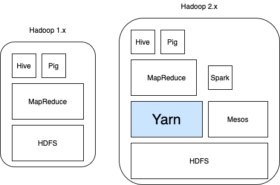

# Hadoop Yarn

## 왜 Resource Manager가 필요해졌을까?
먼저 Hadoop1과 2의 아키텍쳐를 비교해보자

기존의 MapReduce가 위로 밀려나고 리소스 관리를 전담하는 레이어를 만들었으며, 이것이 Yarn이다. Mesos또한 Yarn과 같은 기능을 한다.
Hadoop1에서는 MapReduce가 Yarn의 기본 기능을 포함한 형태였고 Hadoop2에서는 Hadoop1의 Job Scheduling과 Monitoring, 그리고 Cluster 전체에 이르는 리소스 관리를 독립적인 Process로 분리하였으며 이게 Yarn이다. 간단하게 말하면, Hadoop1의 MapReduce는 Job 관리 기능까지 몰아넣은 형태였다면, Hadoop2는 Job관리 부분은 Yarn으로, 데이터처리 부분은 MapReduce에 남겨두었다고 할 수 있다.
